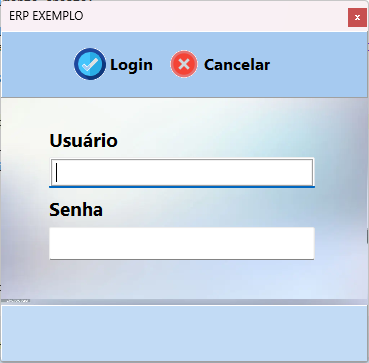
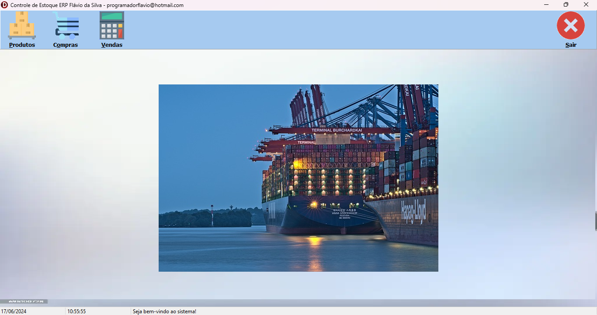
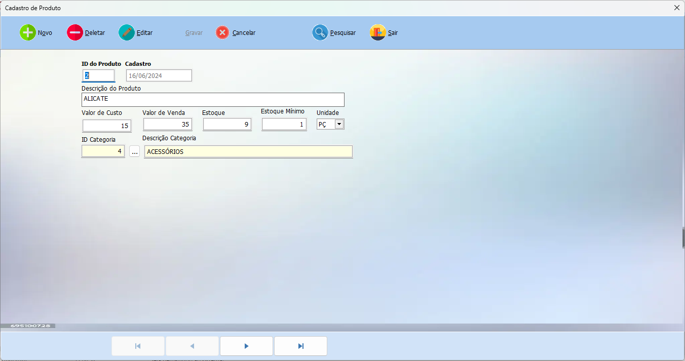
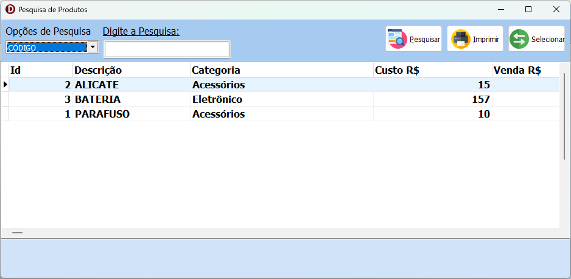
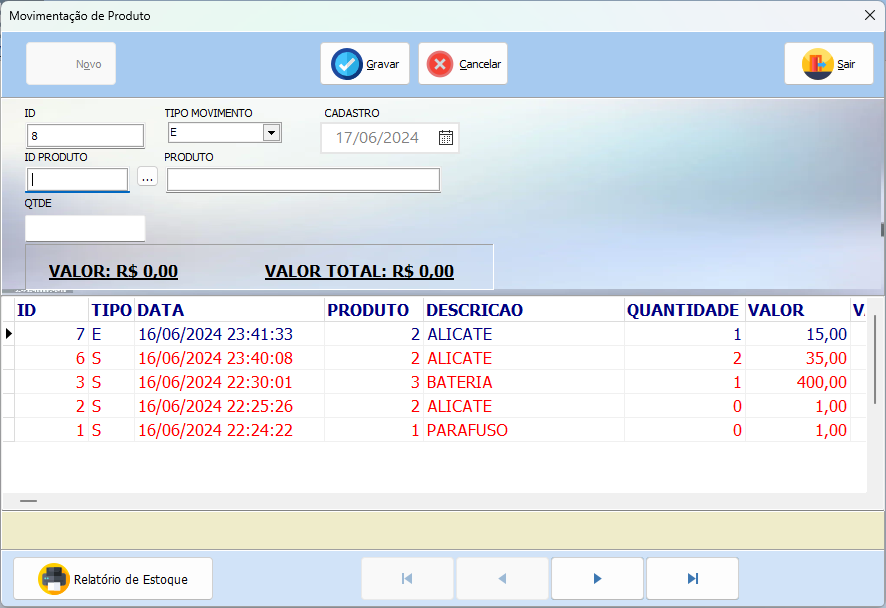
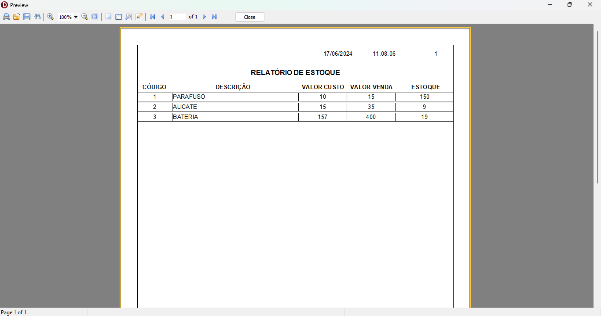

Para realizar o Login padrão ao sistema entre com o login ADMIN e senha 123

# INSTALAÇÃO

## Banco de Dados

A aplicação utiliza o Banco de Dados Firebird SQL 2.5

## Ambiente IDE 

Foi utilizado o Delphi 12.1 para a implementação das funcionalidades

## Cadastro

Foi disponibilizado o cadastro de produtos

## Buscar Produto

Para buscar um produto, basta clicar no botão pesquisar na parte superior.
A busca permite filtrar algumas informações como código, descrição, categoria ou todos.

*Para editar um registro deve-se clicar no botão editar e após isso em Gravar*

## Movimentação de Produto e Relatório

Foi disponibilizada uma tela para movimentação de produtos, dependendo da operação escolhida na
tela inicial do sistema, a movimentação pode ser do tipo entrada ou saída. 
O sistema alimenta essa informação automaticamente e atualiza o estoque adequadamente.

Na tela de Movimentação existe o relatório de Estoque.

